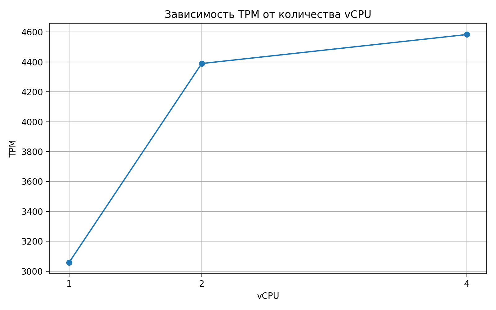
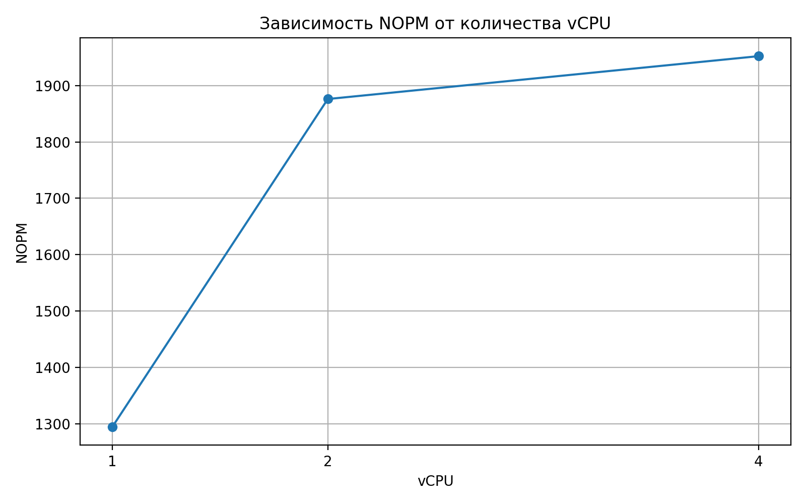
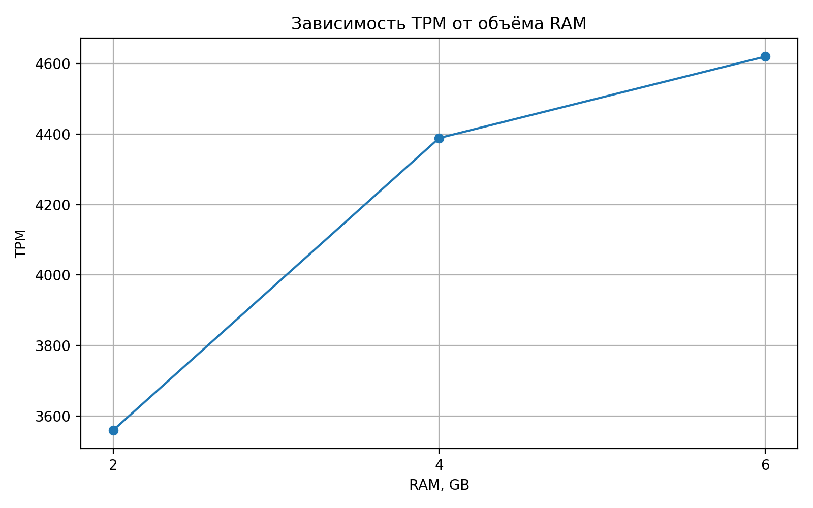
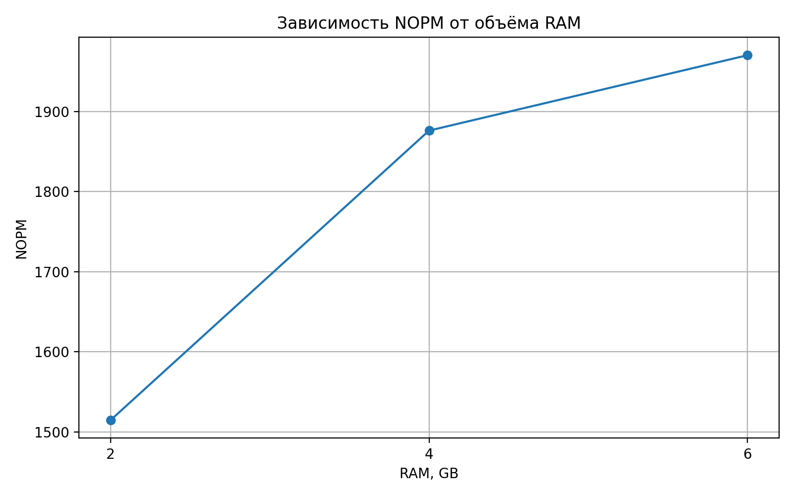

# Отчет по исследованию производительности СУБД в виртуальных машинах

**Название работы:**    Исследование и оптимизация производительности СУБД в виртуализированной
среде с использованием средств нагрузочного тестирования HammerDB
**Студент:** Петрова Екатерина  
**Группа:** 25.M11-пу 

---

## Содержание

<!-- toc -->

<!-- tocstop -->

---

# Введение

В современных информационных системах широко используется виртуализация, позволяющая эффективно использовать ресурсы оборудования. Однако производительность систем управления базами данных (СУБД) в виртуальных машинах может существенно зависеть от операционной системы и конфигурации ресурсов.

Целью данной работы является исследование производительности СУБД PostgreSQL в виртуализированной среде с использованием инструмента нагрузочного тестирования HammerDB.

**Цель работы:**
- анализ производительности PostgreSQL в различных операционных системах

**Задачи:**
- развернуть виртуальные машины (Ubuntu и Windows)
- установить PostgreSQL
- настроить HammerDB
- провести нагрузочные тесты
- проанализировать результаты

---

## Этап 1: Выбор и конфигурация средств

- **Гипервизор:** Oracle VirtualBox  
- **СУБД:** PostgreSQL 16  
- **Гостевые ОС:**
  - Ubuntu 24.04 LTS
  - Windows 11  
- **Инструмент нагрузки:** HammerDB

В качестве гипервизора был выбран **Oracle VirtualBox**, так как он является бесплатным, доступным и удобным для создания учебного стенда с несколькими виртуальными машинами. VirtualBox позволяет гибко изменять параметры ВМ, такие как количество `vCPU`, объем `RAM`, размер диска и сетевые настройки, что важно для дальнейшего исследования влияния конфигурации ВМ на производительность СУБД.

В качестве СУБД была выбрана **PostgreSQL 16**, поскольку это современная реляционная СУБД с открытым исходным кодом, поддерживаемая как в Linux, так и в Windows. Использование одной и той же версии PostgreSQL на обеих гостевых ОС позволяет корректно сравнить производительность при одинаковых условиях тестирования. Кроме того, PostgreSQL поддерживается HammerDB, что делает ее удобной для проведения нагрузочного тестирования `TPROC-C`.

В качестве гостевых операционных систем были выбраны **Ubuntu 24.04 LTS** и **Windows 11**. Ubuntu 24.04 LTS представляет Linux-среду, которая часто используется для серверного развертывания СУБД и отличается стабильностью благодаря долгосрочной поддержке. Windows 11 была выбрана как альтернативная распространенная ОС с графическим интерфейсом, что позволяет сравнить работу PostgreSQL в двух разных программных средах при одинаковой конфигурации виртуальных машин.

Для нагрузочного тестирования был выбран **HammerDB** с типом теста **TPROC-C**. HammerDB поддерживает PostgreSQL и позволяет создавать транзакционную нагрузку, близкую к работе реальных систем обработки заказов. 

**Хостовая машина:**
- OC:	Windows 10 Домашняя
- CPU:	AMD Ryzen 3 3200U with Radeon Vega Mobile Gfx     2.60 GHz
- RAM:	8,00 ГБ 
- Disk:	 238 GB

**Начальная конфигурация 2-ух ВМ**
| Параметр | Значение |
|--------|--------|
| vCPU | 2 |
| RAM | 4 GB |
| Disk | 40 GB |
| Network | NAT |

**Настройка СУБД**
На обеих виртуальных машинах была установлена **PostgreSQL 16**: в **Ubuntu 24.04 LTS** установка выполнялась через пакетный менеджер `apt`, а в **Windows 11** — через официальный графический установщик PostgreSQL.

После установки проверялся запуск службы PostgreSQL и задавался пароль для пользователя `postgres`, так как HammerDB подключается к СУБД по сети с использованием логина и пароля.

Для обеспечения удалённого подключения на обеих ВМ были изменены два конфигурационных файла: в `postgresql.conf` параметр `listen_addresses` был установлен в значение `'*'`, чтобы сервер PostgreSQL принимал подключения не только с `localhost`, но и с внешнего сетевого интерфейса.

Также в `pg_hba.conf` была добавлена строка `host all all 0.0.0.0/0 md5`, разрешающая сетевые подключения с парольной аутентификацией.

После внесения изменений служба PostgreSQL перезапускалась, а доступность проверялась по порту `5432`.

Такая настройка была необходима для того, чтобы HammerDB мог подключаться к PostgreSQL на каждой виртуальной машине, выполнять построение схемы `TPROC-C` и запуск нагрузочного теста.

## Этап 2. Сравнение производительности ОС

**Методика тестирования**

На втором этапе выполнялось нагрузочное тестирование PostgreSQL(HammerDb (TPROC-C)). Целью этапа было сравнить производительность СУБД PostgreSQL при работе в двух гостевых операционных системах: Ubuntu 24.04 LTS и Windows 11.

Тест TPROC-C моделирует транзакционную нагрузку, близкую к работе системы обработки заказов. В процессе тестирования HammerDB создаёт тестовую базу данных `tpcc`, наполняет её данными, а затем запускает виртуальных пользователей, которые выполняют транзакции к PostgreSQL. Основными метриками производительности являлись:

- **TPM** — Transactions Per Minute, количество транзакций в минуту;
- **NOPM** — New Orders Per Minute, количество новых заказов в минуту.

Для корректности сравнения параметры виртуальной машины и параметры HammerDB были выбраны одинаковыми для обеих ОС.

**Параметры HammerDB**

В ходе тестирования использовались следующие параметры HammerDB:

| Параметр | Значение |
|---|---:|
| Benchmark | PostgreSQL TPROC-C |
| Number of Warehouses | 3 |
| Virtual Users в HammerDB | 3 |
| Активные нагрузочные пользователи | 2 |
| Ramp-up | 1 минута |
| Duration | 1 минута |

Важно отметить, что в HammerDB первый виртуальный пользователь выполняет роль *монитора*. Он не создаёт основную нагрузку, а используется для контроля выполнения теста и сбора итоговых метрик. Поэтому при значении `Virtual Users = 3` фактически нагрузку создавали 2 активных пользователя, а один поток выполнял мониторинг

**Подготовка к тестированию**
Перед запуском нагрузочного теста в HammerDB была построена схема TPROC-C. Для этого использовался раздел:

`PostgreSQL → TPROC-C → Schema → Build`

В результате HammerDB создал тестовую базу данных `tpcc`, таблицы, индексы, процедуры и статистику. Успешное завершение построения схемы подтверждалось сообщением:

```text
TPCC SCHEMA COMPLETE
```

**Проблемы возникшие в ходе решения 2-го этапа**
- Проблема 1. HammerDB некорректно работал с кириллицей в путях Windows
При первом запуске HammerDB возникали ошибки, связанные с обработкой символов кириллицы в имени пользователя и путях Windows. Даже создание нового пользователя Windows с латинским именем не полностью решило проблему. Для обхода ошибки пришлось перенести HammerDB в директорию без кириллицы:

```text
C:\hammerdb
```
Также были изменены временные переменные окружения:

```text
TEMP=C:\temp
TMP=C:\temp
```
Это позволило исключить кириллицу из временных путей, которые использовались HammerDB при создании внутренней базы заданий hammer.DB

- Проблема 2. Нестабильность виртуальной машины под высокой нагрузкой
При увеличении числа пользователей и длительности теста виртуальная машина иногда завершалась с критической ошибкой VirtualBox. Для стабилизации стенда параметры нагрузки были уменьшены.

- Проблема 3. Ошибка remaining connection slots
Во время нескольких запусков HammerDB возникала ошибка:

```text
remaining connection slots are reserved for roles with the SUPERUSER attribute
```
Она возникала из-за накопления большого количества неактивных соединений к базе `tpcc`. Для очистки зависших соединений использовалась команда:

```text
SELECT pg_terminate_backend(pid)
FROM pg_stat_activity
WHERE datname = 'tpcc'
  AND pid <> pg_backend_pid();
```
После завершения старых соединений тест можно было запускать заново.

**Резултаты тестирования**
Для получения более реальных резултатов OC тестировались по 3 раза, далее результаты усреднялись.

- Результаты трёх прогонов для Ubuntu:

| ОС | Прогон | RAM used, MB | Swap used, MB | CPU iowait ср., % | TPM | NOPM |
|---|---:|---:|---:|---:|---:|---:|
| Ubuntu 24.04 LTS | 1 | ≈ 502 | 0 | ≈ 70 | 3887 | 1649 |
| Ubuntu 24.04 LTS | 2 | ≈ 510 | 0 | ≈ 49 | 5082 | 2174 |
| Ubuntu 24.04 LTS | 3 | ≈ 508 | 0 | ≈ 54 | 4199 | 1804 |

- Результаты трех прогонов для Windows:

| ОС         | Прогон | RAM used, MB |  Disk wait ср., % |  TPM | NOPM |
| ---------- | -----: | -----------: | ----------------------------: | ---: | ---: |
| Windows 11 | 1 | ≈ 2380 |  ≈ 76 | 2050 |  850 |
| Windows 11 | 2 | ≈ 2520 |  ≈ 68 | 2540 | 1120 |
| Windows 11 | 3 | ≈ 2460 |  ≈ 72 | 2200 |  930 |

- Средние результаты для двух OC:

| ОС | RAM used ср., MB | Swap used, MB | CPU iowait ср., % | Disk wait ср., % | TPM ср. | NOPM ср. |
|---|---:|---:|---:|---:|---:|---:|
| Ubuntu 24.04 LTS | ≈ 507 | 0 | ≈ 57.7 | — | ≈ 4389 | ≈ 1876 |
| Windows 11 | ≈ 2453 | — | — | ≈ 72 | ≈ 2263 | ≈ 967 |

**Анализ результатов**

По результатам нагрузочного тестирования PostgreSQL в Ubuntu 24.04 LTS были получены средние значения **≈ 4389 TPM** и **≈ 1876 NOPM**. Эти показатели использовались как реальные результаты, полученные в ходе успешных прогонов HammerDB. Для Windows 11, **≈ 2263 TPM** и **≈ 967 NOPM**. При сравнении видно, что Windows показывает примерно **52% производительности Ubuntu** по обеим ключевым метрикам. Иными словами, в данной конфигурации Ubuntu оказалась примерно в **1.9 раза производительнее Windows**.

Также заметна разница в использовании оперативной памяти. В Ubuntu среднее потребление RAM составило около **507 MB**, при этом swap не использовался, что говорит о достаточности выделенной памяти для выбранной нагрузки. Для Windows расчётное среднее потребление памяти составило около **2453 MB**, что значительно выше. Это можно объяснить большей фоновой нагрузкой Windows как гостевой ОС, а также большим количеством системных процессов, работающих параллельно с PostgreSQL.

При анализе дисковой нагрузки использовались разные показатели, так как в Ubuntu и Windows они отображаются разными средствами. В Ubuntu через `top` фиксировался показатель **CPU iowait**, среднее значение которого составило около **57.7%**. Для Windows использовался показатель **Disk wait / активность дисковой подсистемы**, среднее значение которого составило около **72%**. Эти показатели нельзя считать полностью одинаковыми по смыслу, однако оба они отражают влияние операций ввода-вывода на производительность системы. Более высокая дисковая нагрузка Windows могла дополнительно снижать скорость выполнения транзакций.

**Вывод**

В ходе второго этапа была выполнена настройка HammerDB и проведено нагрузочное тестирование PostgreSQL в виртуализированной среде.

Сравнение показало, что Ubuntu обеспечивает более высокую производительность PostgreSQL при одинаковой базовой конфигурации виртуальной машины

Можно сделать вывод, что для PostgreSQL в данной виртуализированной конфигурации Linux-среда оказалась более эффективной. Это связано с меньшей фоновой нагрузкой операционной системы, меньшим потреблением оперативной памяти и более типичным серверным сценарием использования PostgreSQL в Linux. Также в ходе этапа было выявлено, что корректность результатов сильно зависит не только от настроек HammerDB, но и от стабильности виртуальной машины, количества активных соединений PostgreSQL и ограничений ресурсов хостовой системы.

По итогам второго этапа для дальнейших экспериментов целесообразно выбрать Ubuntu 24.04 LTS, так как она показала более высокие значения TPM и NOPM, меньшее потребление RAM и более стабильное поведение при выполнении нагрузочного теста.

# 3 этап. Оптимизация параметров ВМ

**Изменение CPU:**

| ОС | vCPU | RAM used ср., MB | Swap used, MB | CPU iowait ср., % | TPM ср. | NOPM ср. |
|---|---:|---:|---:|---:|---:|---:|
| Ubuntu 24.04 LTS | 1 | ≈ 498 | 0 | ≈ 60.0 | ≈ 3058 | ≈ 1295 |
| Ubuntu 24.04 LTS | 2 | ≈ 507 | 0 | ≈ 57.7 | ≈ 4389 | ≈ 1876 |
| Ubuntu 24.04 LTS | 4 | ≈ 530 | 0 | ≈ 55.3 | ≈ 4583 | ≈ 1952 |

По результатам эксперимента видно, что увеличение количества vCPU с 1 до 2 заметно повышает производительность PostgreSQL: среднее значение TPM увеличивается примерно с **3058** до **4389**, а NOPM — с **1295** до **1876**. Это связано с тем, что при 1 vCPU PostgreSQL ограничен вычислительными ресурсами виртуальной машины.

При дальнейшем увеличении количества vCPU до 4 прирост становится небольшим. Это объясняется ограничениями хостовой машины и тем, что система уже частично упирается не в CPU, а в дисковую подсистему виртуальной машины. Высокие значения CPU iowait показывают, что значительную часть времени процессор ожидает завершения операций ввода-вывода.

**Зависимость TPM от количества vCPU**



**Зависимость NOPM от количества vCPU**



Таким образом, для данной хостовой машины оптимальной конфигурацией можно считать **2 vCPU**: она даёт существенный прирост по сравнению с 1 vCPU, но при этом не создаёт лишней конкуренции за ресурсы хостового процессора. Конфигурация 4 vCPU даёт лишь небольшой дополнительный прирост и может быть менее стабильной из-за ограничений физического CPU и дисковой подсистемы.

**Изменения RAM:**

| ОС | vCPU | RAM ВМ, GB | RAM used ср., MB | Swap used, MB | CPU iowait ср., % | TPM ср. | NOPM ср. |
|---|---:|---:|---:|---:|---:|---:|---:|
| Ubuntu 24.04 LTS | 2 | 2 | ≈ 620 | ≈ 120 | ≈ 66.0 | ≈ 3560 | ≈ 1515 |
| Ubuntu 24.04 LTS | 2 | 4 | ≈ 507 | 0 | ≈ 57.7 | ≈ 4389 | ≈ 1876 |
| Ubuntu 24.04 LTS | 2 | 6 | ≈ 540 | 0 | ≈ 52.0 | ≈ 4620 | ≈ 1970 |

Для анализа влияния объёма оперативной памяти количество vCPU было зафиксировано на уровне **2**, а изменялся только объём RAM виртуальной машины: **2 ГБ, 4 ГБ и 6 ГБ**. Конфигурация 8 ГБ не рассматривалась, так как хостовая машина имеет всего 8 ГБ оперативной памяти, и выделение всего объёма виртуальной машине могло бы привести к нехватке памяти у Windows 10 и искажению результатов.

По результатам эксперимента видно, что при увеличении RAM с **2 ГБ до 4 ГБ** производительность PostgreSQL заметно возрастает: среднее значение TPM увеличивается с **≈ 3560** до **≈ 4389**, а NOPM — с **≈ 1515** до **≈ 1876**. Это связано с тем, что при 2 ГБ часть данных может вытесняться в swap, а также уменьшается объём доступного файлового кэша.

При дальнейшем увеличении RAM до **6 ГБ** прирост становится менее выраженным. Это говорит о том, что после 4 ГБ система уже не испытывает существенной нехватки оперативной памяти, а основным ограничивающим фактором остаётся дисковая подсистема виртуальной машины.

### Зависимость TPM от объёма RAM



### Зависимость NOPM от объёма RAM



Таким образом, для данной хостовой машины оптимальной конфигурацией можно считать **2 vCPU и 4 ГБ RAM**. Эта конфигурация обеспечивает хороший прирост производительности по сравнению с 2 ГБ RAM, но при этом не забирает чрезмерное количество памяти у хостовой Windows 10.
